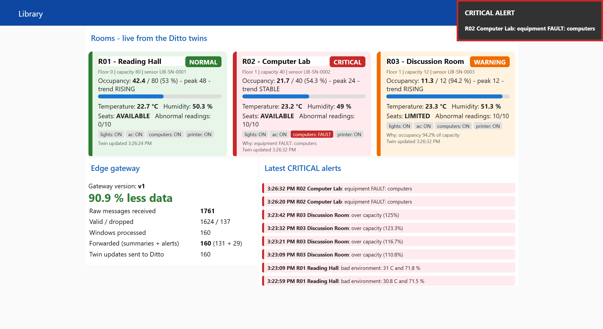

# Smart Library Monitoring – Edge Gateway + Digital Twin

Monitors 3 library rooms (R01 Reading Hall, R02 Computer Lab, R03 Discussion Room) with simulated sensors.
Covers **Q1** (Docker edge management), **Q2** (MQTT + Node-RED edge gateway), **Q5** (Eclipse Ditto digital twin).
Everything runs in Docker – no hardware needed.



Docs: [step-by-step walkthrough (PDF)](docs/Sensor-to-Dashboard-Walkthrough.pdf) · [architecture + flowcharts](docs/smart-library-architecture.html)

## How to run

### 1. Requirements
- **Docker Desktop** (Windows / macOS) or Docker Engine + Compose v2 (Linux)
- Give Docker about **8 GB of memory** (Docker Desktop → Settings → Resources). Ditto uses ~3 GB.
- **Git**, to clone the project
- Free ports **1880**, **1883** and **8080**

### 2. Get the code
```bash
git clone https://github.com/loopingdhanush/cloud-project.git
```
```bash
cd cloud-project
```

### 3. Start everything
Option A: build the images on your machine:
```bash
docker compose up -d --build
```
Option B: use the ready-made images from Docker Hub (no build):
```bash
docker compose pull mongodb policies things things-search gateway mosquitto nginx nodered simulator
```
```bash
docker compose up -d --no-build
```

The first start takes about **1–2 minutes** (Ditto is Java). Compose starts things in order:
Ditto → twin-setup (creates the room twins) → Mosquitto → Node-RED → simulator.

### 4. Check it is running
```bash
docker compose ps
```
All containers should be `Up` / `healthy`. `library-twin-setup` shows `Exited (0)`, which is correct: it runs once.

### 5. Open the outputs
| What | URL |
|---|---|
| Library dashboard | http://localhost:1880/ui |
| Node-RED editor (gateway flow) | http://localhost:1880 |
| Ditto REST API (user `ditto`, pass `ditto`) | http://localhost:8080/api/2/things/library:R01 |
| MQTT broker | localhost:1883 |

Within ~15 seconds the room cards fill in. Within ~2 minutes you see all three colours (NORMAL / WARNING / CRITICAL) and alert popups.

### 6. Stop
```bash
docker compose down
```
To also delete the stored twins (fresh start next time):
```bash
docker compose down -v
```

### Troubleshooting
- **Dashboard says "Ditto not reachable"**: Ditto is still starting. Wait a minute, then check `docker compose ps`.
- **A container keeps restarting**: Docker has too little memory. Raise it to 8 GB.
- **Port already in use**: stop whatever uses 1880 / 1883 / 8080, or change the left side of `ports:` in `docker-compose.yml`.

## Containers

Compose project: `smart-library`. Full explanation with flowcharts: [docs/smart-library-architecture.html](docs/smart-library-architecture.html)

| Container | Service | Image | Role |
|---|---|---|---|
| library-sensors | simulator | `loopingdhanush/library-sensors:1.0` | publishes readings to `library/<room>/telemetry` every 1 s, ~8 % invalid |
| library-mqtt-broker | mosquitto | `eclipse-mosquitto:2.0.22` | MQTT broker (:1883) |
| library-edge-gateway | nodered | `loopingdhanush/library-gateway:v1/v2` | Node-RED edge gateway + dashboard (:1880) |
| library-ditto-nginx | nginx | `loopingdhanush/library-ditto-nginx:1.0` | basic auth in front of Ditto (:8080) |
| library-ditto-gateway | gateway | `eclipse/ditto-gateway:3.9.7` | Ditto REST API |
| library-ditto-things | things | `eclipse/ditto-things:3.9.7` | stores the room twins |
| library-ditto-policies | policies | `eclipse/ditto-policies:3.9.7` | access control for the twins |
| library-ditto-search | things-search | `eclipse/ditto-things-search:3.9.7` | search queries over twins |
| library-ditto-mongodb | mongodb | `mongo:7.0` | database for Ditto |
| library-twin-setup | twin-setup | `loopingdhanush/library-sensors:1.0` | one-shot: creates the Ditto Things, then exits |

## Gateway flow (Node-RED)

1. **Validate & convert** – drops broken JSON, missing / non-numeric values, impossible values (occupancy < 0, temp > 50 °C, humidity > 100 %). Converts Fahrenheit → Celsius (R02 vendor) and equipment codes 0/1/2 → OFF/ON/FAULT. Output = common JSON.
2. **Window features & status** – 10 valid readings per room → average/peak occupancy, % of capacity, avg temperature, avg humidity, abnormal count, equipment faults, occupancy trend (rising over 4 windows and > 70 % → SeatAvailability `LIMITED`).
3. **Rules**: NORMAL (20–26 °C, 40–60 %, < 80 % occupancy, no faults) · WARNING (temp or humidity out, or 80–100 %) · CRITICAL (> 100 %, any FAULT, or temp AND humidity out).
4. **Edge decision** – NORMAL/WARNING → `library/<room>/summary`; CRITICAL → `library/alerts` + dashboard popup.
5. **Twin update** – JSON merge-patch `PATCH /api/2/things/library:<room>` (features occupancy, environment, equipment, status, SeatAvailability).
6. **Stats** – raw vs forwarded counts written to twin `library:gateway` every 5 s.

Demo scenario (repeats every 4 min): R01 gets too warm (WARNING) then hot + humid (CRITICAL);
R02 gets busy (WARNING) then a computer FAULT (CRITICAL); R03 keeps filling up → LIMITED → over capacity (CRITICAL).

## Useful commands

Query the twins (GET + search):
```bash
docker compose run --rm simulator python query_twins.py
```

Raw vs forwarded messages over 60 s:
```bash
docker compose run --rm simulator python compare_traffic.py 60
```

Tests (pytest):
```bash
docker compose run --rm simulator pytest -v tests
```

cURL against Ditto:
```bash
curl -u ditto:ditto http://localhost:8080/api/2/things/library:R03
```

Docker management demo (status, logs, stop, restart, update v1 → v2) – interactive:
```bash
powershell -ExecutionPolicy Bypass -File scripts/docker_demo.ps1
```

Gateway logs (CRITICAL alerts are printed here):
```bash
docker logs -f library-edge-gateway
```

**v1 → v2:** same flow, but v2 alerts also contain a recommended *action* for the staff
(e.g. "Send students to another room"). Version is shown on the dashboard.

## Push to Docker Hub

1. Put your Docker Hub username in `.env` (`DOCKERHUB_USER=...`)
2. `docker login`
3. `powershell -ExecutionPolicy Bypass -File scripts/push_dockerhub.ps1`
